Modbus RTU Demo Quickstart Guide
================================

This simple demonstration of xTIMEcomposer Studio functionality that uses the ``XA-SK-ISBUS`` and ``XA-SK-GPIO`` Slice Cards together with the xSOFTip ``module_modbus_rtu`` and ``module_i2c_master`` to demonstrate how to receive commands from a Modbus Master over RS485 bus and service them to:

- Turn GPIO Slice Card LEDs on and off
- Read the room temperature via the on-board ADC
- Display GPIO Slice Card button presses

Hardware Setup
++++++++++++++

The Modbus RTU Demo Application requires the following items:

- XP-SKC-L2 Slicekit Core board marked with edge connectors: ``SQUARE``, ``CIRCLE``, ``TRIANGLE`` and ``STAR``.
- XA-SK-ISBUS Ethernet Slice Card
- XA-SK-GPIO GPIO Slice Card
- XTAG2 and XTAG Adapter
- Ethernet Cable and
- 12V DC power supply

Options to send data from PC application over RS485:

#. Using a *USB to RS232 converter* plus *RS232 to RS485 converter*. We will use this option for the demo.
#. Using a *USB to RS485* converter.

To setup the system:

#. Connect the XTAG Adapter to Slicekit Core board, and connect XTAG-2 to the adapter.
#. Connect the XTAG-2 to host PC. Note that the USB cable is not provided with the Slicekit starter kit.
#. Connect XA-SK-GPIO Slice Card to the XP-SKC-L2 Slicekit Core board using the connector marked with the ``SQUARE``.
#. Connect XA-SK-ISBUS Slice Card to the XP-SKC-L2 Slicekit Core board using the connector marked with the ``TRIANGLE``.
#. Connect the **USB side** of *USB to RS232 converter* to a USB slot in your PC.
#. Connect the **RS232 side** of *USB to RS232 converter* to **RS232 side** of *RS232 to RS485 converter*.
#. Connect the following pins present on the **RS485 side** of *RS232 to RS485 converter* to XA-SK-ISBUS Slice Card:

   +----------------+------------------+
   | RS485 side of  | XA-SK-ISBUS pins |
   | RS232 to RS485 |                  |
   | converter      |                  |
   +================+==================+
   | D+/A           | Header P1-Pin 1  |
   +----------------+------------------+
   | D-/B           | Header P1-Pin 2  |
   +----------------+------------------+
   | GND            | Header P1-Pin 3  |
   +----------------+------------------+
   | Power          | Header P3-Pin 1  |
   +----------------+------------------+

#. Switch on the power supply to the Slicekit Core board.

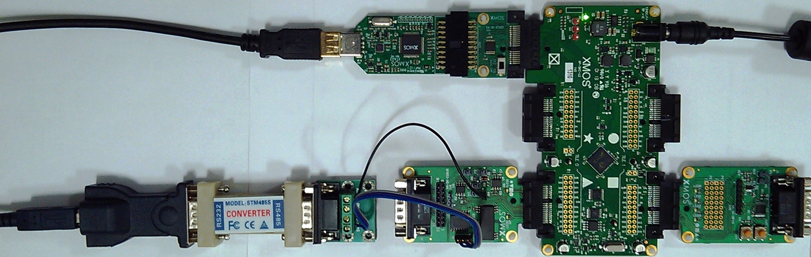

   Hardware Setup for a Modbus RTU Demo

Host Computer Setup
+++++++++++++++++++

COM port setup on PC
--------------------

The *USB to RS232 converter* will list as a COM port in your Windows PC. The demo applications has certain configurations for RS485 data like Baud, Parity, etc... The PC side terminal must be configured accordingly for proper data transfer.

To setup COM port parameters on a Windows PC, navigate to *Device Manager* of your PC. This can be opened by:

- Click Start
- Right click on *Computer* option and click on *Properties*
- A new window opens with the computer properties.
- *Device Manager* is located left hand side pane of this window.

In the *Device Manager* window, select *Ports (COM & LPT)* and double click on your *USB to RS232 converter* from this list.

Change to *Port Settings* tab and set:

   - Bits per second as 9600
   - Data bits as 8
   - Parity as Even
   - Stop bits as 1
   - Flow control as None

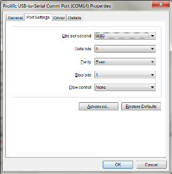

   COM port setup

At this point, please note the COM port number (here, COM14). Click *OK* to close the window.

Modbus Master Emulator
----------------------

A Modbus Master application such as Simply Modbus RTU PC application is available from http://www.simplymodbus.ca/RTUmaster.htm. Download the installer and install the application on your PC by running it. You can open the Modbus master emulator using Start -> All Programs -> Simply Modbus -> Simply Modbus.

Please see the online manual for SimplyModbus RTU here: http://www.simplymodbus.ca/manual.htm for help on creating Modbus commands.

The commands could also be stored (saved) and restored to/from the PC memory for later use. These saved files may also be called as configurations. The folder ($\\app_modbus_rtu\\simplymodbus_config\\) contains sample Simply Modbus TCP specific configuration files to perform Read / Write operations. These files can be loaded by clicking on ``RESTORE CFG`` button from the Simply Modbus PC application.

Import and Build the Application
++++++++++++++++++++++++++++++++

#. Open xTIMEcomposer and check that it is operating in online mode. Open the edit perspective (Window->Open Perspective->XMOS Edit).
#. Locate the ``Modbus RTU Demo`` item in the xSOFTip pane on the bottom left of the window and drag it into the Project Explorer window in the xTIMEcomposer. This will also cause the modules on which this application depends to be imported as well.
#. Click on the ``app_modbus_rtu`` item in the Project Explorer pane then click on the build icon (hammer) in xTIMEcomposer. Check the console window to verify that the application has built successfully.

For help in using xTIMEcomposer, try the xTIMEcomposer tutorial, which you can find by selecting (Help->Tutorials) from the xTIMEcomposer menu.

Note that the Developer Column in the xTIMEcomposer on the right hand side of your screen provides information on the xSOFTip components you are using. Select the module_modbus_rtu component in the Project Explorer, and you will see its description together with API documentation. Having done this, click the `back` icon until you return to this quick start guide within the Developer Column.

Run the Application
+++++++++++++++++++

Now that the application has been compiled, the next step is to run it on the Slicekit Core Board using the tools to load the application over JTAG (via the XTAG2 and XTAG Adapter card) into the xCORE multicore microcontroller.

- Select the file ``app_modbus_rtu.xc`` in the ``app_modbus_rtu`` project from the Project Explorer.
- Click on the ``Run`` icon (the white arrow in the green circle).
- At the ``Select Device`` dialog select ``XMOS XTAG-2 connect to L1[0..1]`` and click ``OK``.

The Demo
--------

This demo issues commands to read: coils, input register and discrete inputs and write: coils. Using the XA-SK-GPIO slice card, the coils, etc... are mapped as follows:

   ================  ====================
   Device            on XA-SK-GPIO slice
   ================  ====================
   Coils             LEDs LED0 - LED3
   Input Register    Temperature Sensor
   Discrete Input    Buttons SW1 & SW2
   Holding Register  N/A
   ================  ====================

On your PC, open the SimplyModbus Client from (Start -> All Programs -> Simply Modbus -> Simply Modbus) and adjust to following settings:

   - mode = RTU
   - COM port = 14
   - baud = 9600
   - data bits = 8
   - stop bits = 1
   - parity = even
   - Slave ID = 10

Alternatively, click on ``RESTORE CFG`` and change to `($\\app_modbus_rtu\\simplymodbus_config\\)`. Select the `read_coil.csv` configuration file.

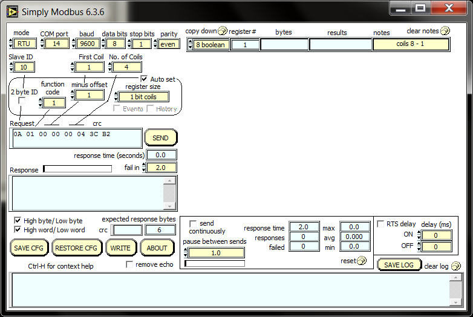

   SimplyModbus opening window with required settings

Switch ON all LEDs
~~~~~~~~~~~~~~~~~~

Switch ON all LEDs using `Write Coil` command. You can issue `write` commands using the ``WRITE`` interface. This can be brought up by clicking the ``WRITE`` button in SimplyModbus.

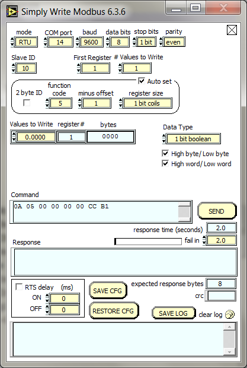

   SimplyModbus WRITE interface

Click on ``RESTORE CFG`` (in the SimplyModbus Write interface window) and change to `($\\app_modbus_rtu\\simplymodbus_config\\)`. Select the `write_coil.csv` configuration file. This will load the WRITE_SINGLE_COIL command in the SimplyModbus write window with `First Register = 1` and `# values to write = 1`. This prepares a `Write Single Coil` command to be issued to the Modbus slave to Write a coil (LED) at address indicated in `First Register` box. Note that, First Register = 1 is address 0, First Register = 2 is address 1 and so on. In this demo, toggle the states of all four LEDs one by one by changing the `First Register` value and clicking on ``SEND``. Notice how the LED state changes on the XA-SK-GPIO slice card.

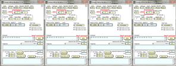

   Toggle LED states

Read LED status
~~~~~~~~~~~~~~~

Switch to SimplyModbus main window. Click on ``RESTORE CFG`` and change to `($\\app_modbus_rtu\\simplymodbus_config\\)`. Select the `read_coil.csv` configuration file. This will load the READ_COIL command in the SimplyModbus main window with `First Coil = 1` and `No. of Coils = 4`. This prepares a `Read Coil` command to be issued to the Modbus slave to read coils from addresses 0 through 3. In this demo, it reads the status of 4 GPIO LEDs on XA-SK-GPIO slice card. The first LED is LED0 on the XA-SK-GPIO slice and the fourth LED is LED3 on XA-SK-GPIO slice. The result is a byte containing the status of LEDs arranged as bit positions (shown in `results` column in the SimplyModbus main window):

   +----+----+----+----+------+------+------+------+
   | XX | XX | XX | XX | LED3 | LED2 | LED1 | LED0 |
   +----+----+----+----+------+------+------+------+

   Where,

   * Bit0 is LED0 status (1 is OFF and 0 is ON)
   * Bit1 is LED1 status (1 is OFF and 0 is ON)
   * Bit2 is LED2 status (1 is OFF and 0 is ON)
   * Bit3 is LED3 status (1 is OFF and 0 is ON)
   * XX is Don't care.

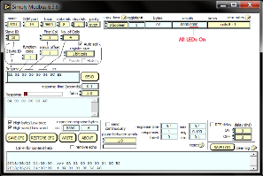

   Read LED status

Switch OFF LED1 and LED3
~~~~~~~~~~~~~~~~~~~~~~~~

Switch OFF LED1 & LED3 using `Write Coil` command. In the SimplyModbus write window change `First Register = 2` and `# values to write = 1`. This prepares a `Write Single Coil` command to be issued to the Modbus slave to Write a coil (LED) at address indicated in `First Register` box. Click on ``SEND``. Notice how LED1 state toggles. Now, set `First Register = 4` and click on ``SEND``. Notice how LED3 state toggles.

Read LED status
~~~~~~~~~~~~~~~

Switch to SimplyModbus main window. Click on ``SEND``. This time, please notice the result (shown in `results` column in the SimplyModbus main window) indicates that LED1 and LED3 are OFF. The LED states are arranged as following in the result:

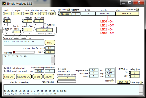

   Read LED status

Read Temperature
~~~~~~~~~~~~~~~~

The temperature can be read by sending a 'Read Input Register' command. In the SimplyModbus main window, click on ``RESTORE CFG`` and change to `($\\app_modbus_rtu\\simplymodbus_config\\)`. Select the `read_ip_reg.csv` configuration file. This will load the READ_INPUT_REGISTER command in the SimplyModbus main window with `First Register = 1` and `No. of Registers = 1`. This prepares a `Read Input Register` command to be issued to the Modbus slave to Read input registers at address 0. In this demo, it reads the current room temperature as recorded by the sensor present on the XA-SK-GPIO slice card. The result (shown in `results` column in the SimplyModbus main window) is a short integer representing the room temperature as responded by the Modbus slave.

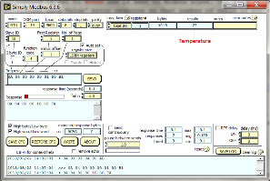

   Read Room Temperature

Read Button States - No Buttons pressed
~~~~~~~~~~~~~~~~~~~~~~~~~~~~~~~~~~~~~~~

To see if a button was pressed (and released) since last read, send a 'Read Discrete Input' command. Click on ``RESTORE CFG`` and change to `($\\app_modbus_rtu\\simplymodbus_config\\)`. Select the `read_dis_ip.csv` configuration file. This will load the READ_DISCRETE_INPUT command in the SimplyModbus main window with `First Coil = 1` and `No. of Coils = 2`. This prepares a `Read Discrete Input` command to be issued to the Modbus slave to Read input registers at addresses 0 through 1. In this demo, it reads button (SW1 & SW2) status on the XA-SK-GPIO slice card. Address 0 is SW1 and Address 1 is SW2. The result (shown in `results` column in the SimplyModbus main window) is a byte of format:

   +----+----+----+----+----+----+-----+-----+
   | XX | XX | XX | XX | XX | XX | SW2 | SW1 |
   +----+----+----+----+----+----+-----+-----+

   Where,

   * Bit0 is SW1 status (1 was Button Pressed and released since last read)
   * Bit1 is SW2 status (1 was Button Pressed and released since last read)
   * XX is Don't care.

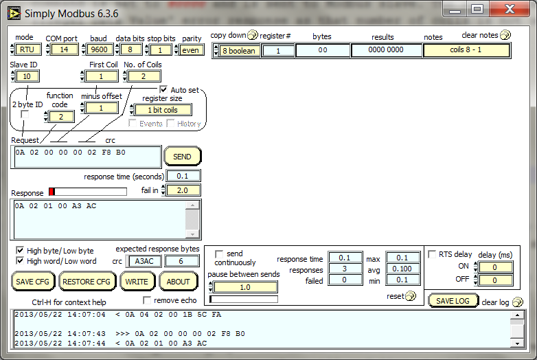

   Read Button Status

Read Button States - SW1 & SW2 pressed
~~~~~~~~~~~~~~~~~~~~~~~~~~~~~~~~~~~~~~

Now press Button SW1 & SW2 on the XA-SK-GPIO slice card. In the SimplyModbus main window, click ``SEND`` again to read the button status. This time, the result byte shows that both buttons were pressed.

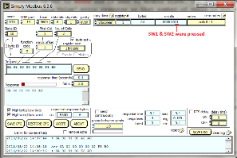

   Read Button Status

Other commands
~~~~~~~~~~~~~~

The values of address and data may be changed based on the application. Any unsupported Function code or data range will result in exception response.

For example, when a Function code '9' is sent to the slave, the slave returns an 'Illegal Function Code' error response as the slave does not support this command.

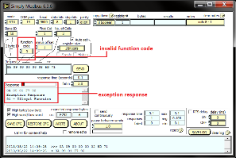

   Illegal Function Code Screenshot

Another example where the number of coils in 'Read Coil' (function code '1') command is set to 80000 and is sent to Modbus slave. The slave returns an 'Illegal Data Value' error response as that number of coils is not supported by the slave.

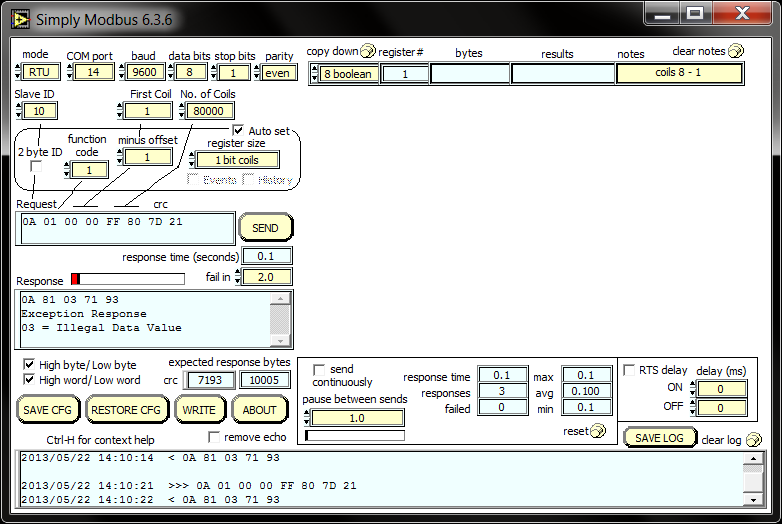

   Illegal Data Value Screenshot

Next Steps
++++++++++

- Try connecting the coils and registers in the app code to show other values. For example, a Read register command from Modbus Master should always read a specific address from the memory.
- Review the modbus application code, in ``app_modbus_rtu``, and review the code in the modbus module itself, ``module_modbus_rtu``. Refer to the documentation for the modubus component module to review the API details and usage.
- The ``module_modbus_rtu`` has an in-built RS485 component. It uses the ``sc_uart`` xSOFTip to receive Modbus commands over RS485 interface. Review the documentation for the ``RS485 Transceiver Component`` item in the xSOFTip Browser pane.
- Review other industrial communications IP, including the ``CAN Bus Module`` and the ``RS485 Transceiver Component`` in the xSOFTip Browser.
